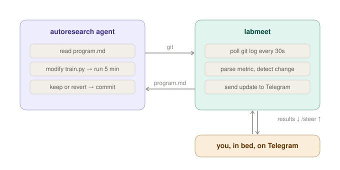

# labmeet

The meat computer still has opinions. `labmeet` is the async lab meeting between you and your [autoresearch](https://github.com/karpathy/autoresearch) agent — it reports results, you decide what to try next. Over Telegram, from your bed, while experiments keep running.

```
🟢 Experiment #47 — IMPROVED
val_bpb: 0.268914
vs best: ↓ 0.001203
Commit: a3f1e2b  increase depth to 12, tune LR schedule

📊 47 experiments · 12 kept · 4.2h · best 0.268914 (−10.36%)
Trend: ▁▂▃▃▄▅▅▆▆▇▇█
```

## What it does

Every time the agent finishes a 5-minute experiment and commits (or reverts), you get a Telegram message with the result, whether it improved, and what changed. You reply to steer the research direction. The agent never knows `labmeet` exists — it just reads `program.md` as usual, and `labmeet` is how you edit it from your phone.



## Quick start

**Requirements:** Python 3.10+, a Telegram account, a running [autoresearch](https://github.com/karpathy/autoresearch) setup.

```bash
# 1. Create a Telegram bot: message @BotFather → /newbot → copy the token

# 2. Install the one dependency
pip install "python-telegram-bot[job-queue]"

# 3. Run labmeet alongside your autoresearch agent
export TELEGRAM_BOT_TOKEN="your-token"
python3 labmeet.py --repo /path/to/autoresearch

# 4. Open Telegram, find your bot, send /start
```

That's it. Now kick off your agent as usual and go to sleep.

## Commands

From Telegram:

| Command | What it does |
|---|---|
| `/progress` | Experiment count, best val_bpb, improvement %, sparkline trend |
| `/results` | Last 10 entries from results.tsv |
| `/diff` | Diff of the most recent commit to train.py |
| `/program` | Show current program.md |
| `/steer <text>` | Append a new direction to program.md |
| `/note <text>` | Save a note to human_notes.md |
| `/log` | Tail of the last run.log |
| `/branch` | Current branch and recent commits |

Any plain text message is saved as a note.

## `/steer`

This is the whole point. From your phone at 2am:

```
/steer Try a cosine annealing schedule with warmup. VRAM has headroom, push TOTAL_BATCH_SIZE to 2**18.
```

This appends your direction to `program.md` with a timestamp. The agent picks it up on its next iteration. You just redirected the research without opening your laptop.

## Design choices

- **Polling, not hooks.** Polls `git log` every 30 seconds. No webhooks, no filesystem watchers, no extra deps. At ~12 experiments/hour, this catches everything.
- **Zero interference.** Never touches `train.py`, never commits, never modifies git state. Pure observer with one write path: `program.md` via `/steer`.
- **Single file.** One Python file, one dependency, no config. Matching the autoresearch philosophy.
- **Agent-agnostic.** Claude, Codex, Gemini — whatever reads `program.md`. labmeet doesn't care.

## Running in background

```bash
# tmux (recommended)
tmux new -s labmeet
python3 labmeet.py --repo /path/to/autoresearch
# Ctrl+B, D to detach

# or nohup
nohup python3 labmeet.py --repo /path/to/autoresearch &
```

## Environment variables

| Variable | Default | Description |
|---|---|---|
| `TELEGRAM_BOT_TOKEN` | (required) | Bot token from @BotFather |
| `TELEGRAM_CHAT_ID` | (auto-detected) | Lock to specific chat ID for security |

## License

MIT
